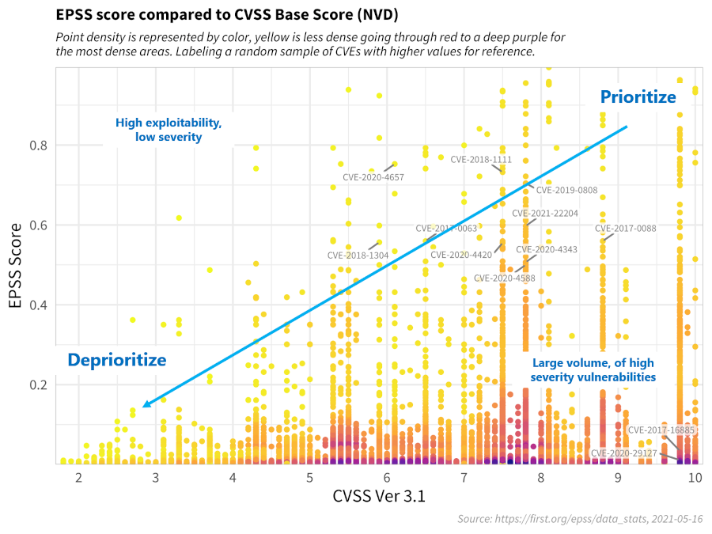
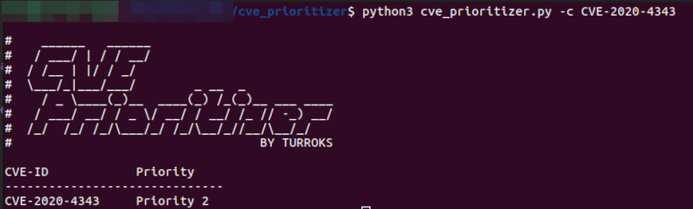
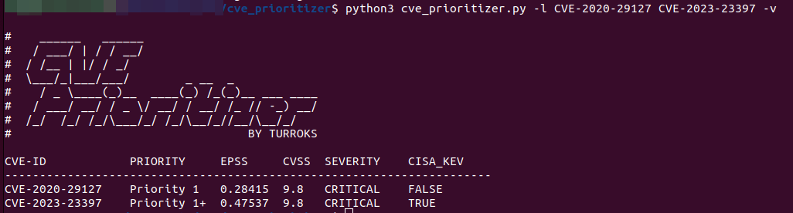
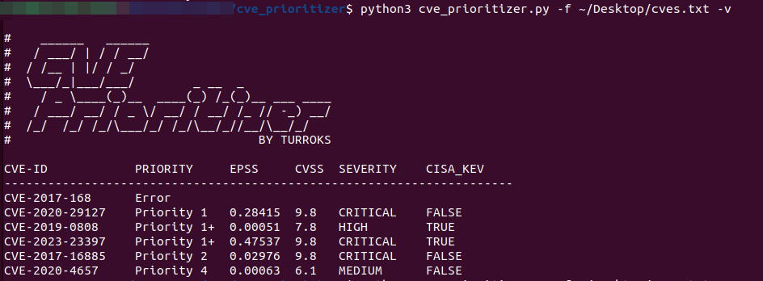
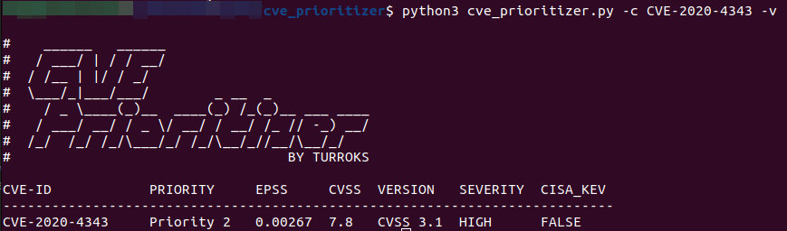

# CVE Prioritizer Tool

CVE_Prioritizer uses [CVSS](https://nvd.nist.gov/vuln-metrics/cvss#), [EPSS](https://www.first.org/epss/data_stats) and 
CISA's [Known Exploited Vulnerabilities](https://www.cisa.gov/known-exploited-vulnerabilities-catalog) to help you 
prioritize vulnerability patching.

## Combining CVSS, EPSS and CISA's Kev

The team at FIRST did an amazing job explaining why one would want to combine CVSS and EPSS in their 
[EPSS User Guide](https://www.first.org/epss/user-guide). The following material has been extracted from that document. 

The figure below shows the correlation between EPSS and CVSS scores based on data from 05-16-2021. Recall that EPSS 
produces prediction scores between 0 and 1 (0 and 100%) where higher scores suggest higher probability of exploit. 
Each dot represents one or more vulnerabilities (CVEs). Some vulnerabilities are labeled for illustrative purposes.

First, observe how most vulnerabilities are concentrated near the bottom of the plot, and only a small percent of 
vulnerabilities have EPSS scores above 50% (0.5). While there is some correlation between EPSS and CVSS scores, overall,
this plot provides suggestive evidence that attackers are not only targeting vulnerabilities that produce the greatest 
impact, or are necessarily easier to exploit (such as for example, an unauthenticated remote code execution).

This is an important finding because it refutes a common assumption that attackers are only looking for — and using — 
the most severe vulnerabilities. And so, how then can a network defender choose among these vulnerabilities when 
deciding what to patch first?

CVSS is a useful tool for capturing the fundamental properties of a vulnerability, but it needs to be used in 
combination with data-driven threat information, like EPSS, in order to better prioritize vulnerability remediation 
efforts.

For the sake of discussion, consider the diagram below, which has been annotated to generally illustrate vulnerability 
priortitization.

- Vulnerabilities in the **bottom left** represent those that have both a lower probability of being exploited, and would 
incur a lower severity impact to the information system, and can therefore be **deprioritized**. 
- Vulnerabilities in the **upper left** quadrant may be more likely to be exploited, but, on their own, would not critically impact the 
information system. (Further research, however, should be conducted in order to better understand how these sorts of 
vulnerabilities may be used in a chained attack.)
- Vulnerabilities in the **bottom right** represent those that, while may severely impact the information system, are much 
less likely to be exploited, relative to others, but should still be watched in the event that the threat landscape 
changes.
- Vulnerabilities in the **upper right** quadrant, on the other hand, are the most critical kinds of vulnerabilities which 
are both more likely to be exploited, and could fully compromise the information system, and should therefore be 
patched first.

This decision strategy as described above emphasizes the tremendous capability of EPSS. A network defender who has 
typically had to address thousands or tens of thousands of exposed vulnerabilities, is now able to spend fewer resources, 
to patch more vulnerabilities that are much more likely to be exploited. This capability to differentiate among 
vulnerabilities has never before been possible.

## Our Approach

We have taken FIRST's recommendation and modified the thresholds based on our own experience.

1. We have **added CISA's Known Exploited Vulnerabilities** to the mix, so vulnerabilities are also prioritized based on 
current and past exploitation.
2. We moved the **CVSS Threshold to 7.0** to give a higher priority to High and Critical Severity vulnerabilities.
3. We moved the **EPSS Threshold to 0.2** as the majority of the vulnerabilities seem to lay below that 0.2 score, giving a
higher relevance for the ones that go above the threshold.

Below is a modified version of FIRST's recommendation with our own approach.

### The Result

Our approach will divide vulnerabilities into 5 possible categories or more specifically priorities:

| **Priority** | **Description**                  |
|--------------|----------------------------------|
| Priority 1+  | CVEs found in CISA's KEV         |
| Priority 1   | CVEs in the Upper Right Quadrant |
| Priority 2   | CVEs in the Lower Right Quadrant |
| Priority 3   | CVEs in the Upper Left Quadrant  |
| Priority 4   | CVEs in the Lower Left Quadrant  |

**Note:** You can define your own thresholds when running the tool to tailor the results to your organization's risk 
appetite.

## Usage

Now that we have explained the sources and our approach, lets take a look at how to use CVE_Prioritizer.

### Inputs

CVE_Prioritizer allows you to provide the input CVEs on different ways.

#### Single CVE

To check a single CVE you can use the -c or --cve flags

`python3 cve_prioritizer.py -c CVE-2020-29127`

#### List of CVEs

You can also provide a list of **space** separated CVEs

`python3 cve_prioritizer.py -l CVE-2020-29127 CVE-2017-16885`

#### File with CVES

You can additionally import a file with CVE IDs (One per line)

`python3 cve_prioritizer.py -f ~\Desktop\CheckThisCVEs.txt`

### Outputs

You can decide how much information is provided by choosing verbose mode, Prioritizer will by default give you the 
summary results (CVE-ID + Priority)

but you can use the -v or --verbose flags to get additional information such as:

- EPSS Score
- CVSS Base Score
- CVSS Version
- CVSS Severity
- CISA KEV Status (TRUE or FALSE)

Happy Patching!