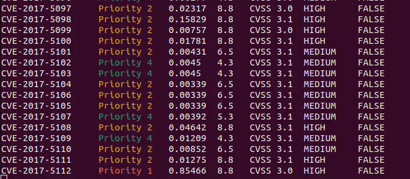
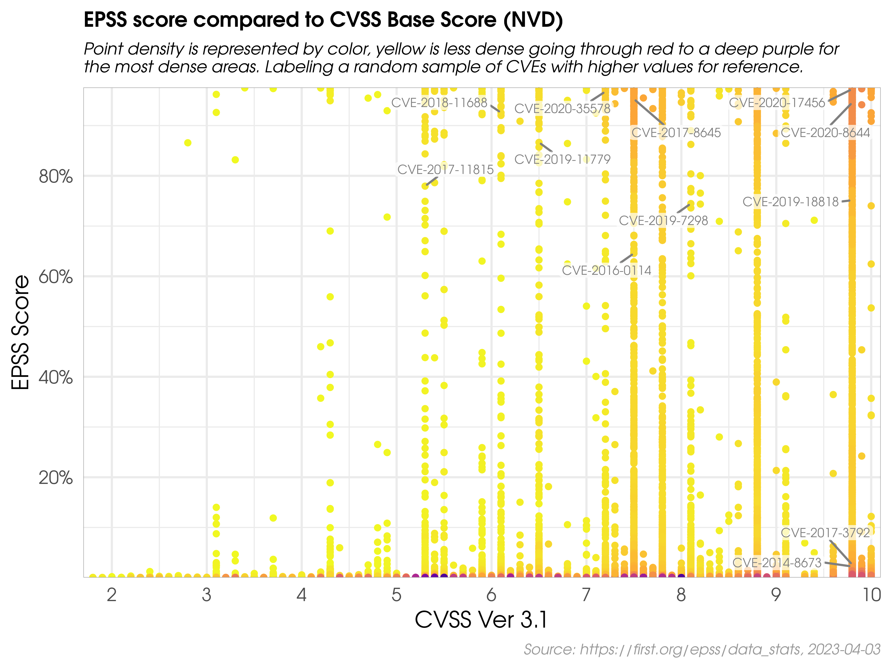

# CVE Prioritizer Tool

CVE_Prioritizer is a powerful tool that helps you prioritize vulnerability patching by combining 
[CVSS](https://nvd.nist.gov/vuln-metrics/cvss#), [EPSS](https://www.first.org/epss/data_stats),  
CISA's [Known Exploited Vulnerabilities](https://www.cisa.gov/known-exploited-vulnerabilities-catalog) and VulnCheck's community resources (
[NVD++](https://docs.vulncheck.com/community/nist-nvd/introduction), 
[KEV](https://docs.vulncheck.com/community/vulncheck-kev/introduction)). 
It provides valuable insights into the likelihood of exploitation and the 
potential impact of vulnerabilities on your information system.

## Why Combine CVSS, EPSS, and CISA's KEV?

CVE_Prioritizer leverages the correlation between CVSS and EPSS scores to enhance vulnerability remediation efforts. 
While CVSS captures the fundamental properties of a vulnerability, EPSS offers data-driven threat information, 
enabling you to better prioritize patching.



## Combining CVSS, EPSS and CISA's Kev

The team at FIRST did an amazing job explaining why one would want to combine CVSS and EPSS in their 
[EPSS User Guide](https://www.first.org/epss/user-guide). The following material has been extracted from that document. 

The figure below shows the correlation between EPSS and CVSS scores based on data from 05-16-2021. Recall that EPSS 
produces prediction scores between 0 and 1 (0 and 100%) where higher scores suggest higher probability of exploit. 
Each dot represents one or more vulnerabilities (CVEs). Some vulnerabilities are labeled for illustrative purposes.



First, observe how most vulnerabilities are concentrated near the bottom of the plot, and only a small percent of 
vulnerabilities have EPSS scores above 50% (0.5). While there is some correlation between EPSS and CVSS scores, overall,
this plot provides suggestive evidence that attackers are not only targeting vulnerabilities that produce the greatest 
impact, or are necessarily easier to exploit (such as for example, an unauthenticated remote code execution).

This is an important finding because it refutes a common assumption that attackers are only looking for (and using) 
the most severe vulnerabilities. And so, how then can a network defender choose among these vulnerabilities when 
deciding what to patch first?

CVSS is a useful tool for capturing the fundamental properties of a vulnerability, but it needs to be used in 
combination with data-driven threat information, like EPSS, in order to better prioritize vulnerability remediation 
efforts.

For the sake of discussion, consider the diagram below, which has been annotated to generally illustrate vulnerability 
prioritization.


- Vulnerabilities in the **bottom left** represent those that have both a lower probability of being exploited, and would 
incur a lower severity impact to the information system, and can therefore be **de-prioritized**. 
- Vulnerabilities in the **upper left** quadrant may be more likely to be exploited, but, on their own, would not critically impact the 
information system. (Further research, however, should be conducted in order to better understand how these sorts of 
vulnerabilities may be used in a chained attack.)
- Vulnerabilities in the **bottom right** represent those that, while may severely impact the information system, are much 
less likely to be exploited, relative to others, but should still be watched in the event that the threat landscape 
changes.
- Vulnerabilities in the **upper right** quadrant, on the other hand, are the most critical kinds of vulnerabilities which 
are both more likely to be exploited, and could fully compromise the information system, and should therefore be 
patched first.

This decision strategy as described above emphasizes the tremendous capability of EPSS. A network defender who has 
typically had to address thousands or tens of thousands of exposed vulnerabilities, is now able to spend fewer resources, 
to patch more vulnerabilities that are much more likely to be exploited. This capability to differentiate among 
vulnerabilities has never before been possible.

## Our Approach

We have refined the prioritization thresholds based on FIRST's recommendations and our own experience. Here's an overview:

1. We **include CISA's Known Exploited Vulnerabilities**, giving priority to CVEs found in KEV.
2. The **CVSS Threshold is set to 6.0**, representing the weighted average CVSS Score from [CVE Details](https://www.cvedetails.com/cvss-score-distribution.php).
3. The **EPSS Threshold is set to 0.2**, focusing on vulnerabilities with higher relevance above this threshold.

This approach categorizes vulnerabilities into five priority levels, allowing you to allocate resources more effectively.

| **Priority** | **Description**                  |
|--------------|----------------------------------|
| Priority 1+  | CVEs found in CISA's KEV         |
| Priority 1   | CVEs in the Upper Right Quadrant |
| Priority 2   | CVEs in the Lower Right Quadrant |
| Priority 3   | CVEs in the Upper Left Quadrant  |
| Priority 4   | CVEs in the Lower Left Quadrant  |


Below is a modified version of FIRST's recommendation after applying our own approach.


**Note:** You can define your own thresholds when running the tool to tailor the results 
to your organization's risk appetite.

## Install
- [Python 3](https://www.python.org/downloads/)
- [Git](https://git-scm.com/downloads)
  
```
git clone https://github.com/TURROKS/CVE_Prioritizer.git
cd ./CVE_Prioritizer/
pip3 install -r requirements.txt
```

## Usage

To use CVE_Prioritizer effectively, follow these steps:

1. Request your API keys to avoid public rate limits. 
   - **NIST NVD:** Free API can be requested [here](https://nvd.nist.gov/developers/request-an-api-key) 
   - **VULNCHECK (Fast):** Register [here](https://vulncheck.com/register), Settings > New Token.
   - **Save APIs:** use the `-sa` or `--set-api` option to save your API Keys in your environment file (.env)
2. Select your CVE Data source
   - **NIST NVD:** This is the default source.
   - **NVD++:** [VulnCheck's](https://vulncheck.com/nvd2) NVD2 solves NIST's API challenges with a reliable, persistent 
connection to their Community NVD 2.0 API that operates at machine speed use `-vc` or `--vulncheck` to select this source.
   - **VUNLCHECK KEV:** VulnCheck also provides a list of Known Exploited Vulnerabilities for free to the community. 
user `-vck` or `vulnchek_kev` to select this source **(ONLY WORKS WITH NVD++)**.
3. Choose one of the following input methods:
   - **Single CVE:** Use the `-c` or `--cve` flags followed by the CVE ID.
   - **List of CVEs:** Provide a **comma-separated** list of CVEs using the `-l` flag.
   - **File with CVEs:** Import a file containing CVE IDs (one per line) using the `-f` flag.
4. Tailor the output according to your needs:
   - Use the `-v` or `--verbose` flags for detailed information, including EPSS Score, CVSS Base Score, CVSS Version, 
   CVSS Severity, and CISA KEV status.
   - Define custom thresholds using the `--cvss` and/or `--epss` flags to align the results with your organization's 
   risk appetite.
   - Define the number of concurrent threads by using the `-t` or `--threads` flags, the default and recommended number
   is 100 to avoid API rate limitations.
   - 

### Examples

#### Single CVE
```
python3 cve_prioritizer.py -c CVE-2020-29127
```


#### List of CVEs

```
python3 cve_prioritizer.py -l CVE-2020-29127 CVE-2017-16885
```


#### File with CVEs

```
python3 cve_prioritizer.py -f ~\Desktop\CheckThisCVEs.txt
```


### Outputs

CVE_Prioritizer provides flexible output options to suit your preferences. By default, it provides a summary of results,
including the CVE-ID and its priority. However, you can enable verbose mode to obtain additional information.

Here are the available output options:

**Summary Results (default):** Provides a concise summary, including the CVE-ID and its priority.


**Verbose Mode:** Enables detailed output with the following information for each CVE:

- EPSS Score
- CVSS Base Score
- CVSS Version
- CVSS Severity
- CISA KEV Status (TRUE or FALSE)


**CSV File**

You can save the results to a CSV file by using the `-o` or `--output` flags

```
python3 cve_prioritizer.py -c CVE-2020-4343 -o ~/Desktop/results.csv
```

This outputs the verbose results independently of the terminal output that you use.


#### Contributing

Please refer to  for guidelines

#### License

This project is licensed under the BSD 3-Clause license - see the  file for details.

#### Contact

For questions or issues, please contact me at prioritizer@proton.me

Happy Patching!

[](https://ko-fi.com/K3K4KOFV4)

#### NVD API Notice: 
Please note that while this tool uses the NVD API, it is not endorsed or certified by the NVD.
